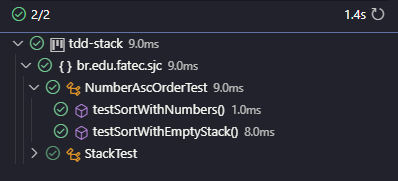

# CLASSE CustomStack
~~~~java
package br.edu.fatec.sjc;

import java.util.ArrayList;
import java.util.List;
import java.util.Stack;

public class CustomStack<T extends  Number> {
    private final Integer limit;
    private int index = 0;
    private List<T> elements;
    private CalculableStrategy<T> calculableStrategy;
    Integer a;
    public CustomStack(int pLimit, CalculableStrategy<T> pCalculableStratey) {
            this.limit = pLimit;
            this.elements = new ArrayList<>();
            this.calculableStrategy = pCalculableStratey;
    }

    public void push(T element) throws StackFullException {
        if(this.size() == this.limit) {
            throw new StackFullException();
        }
        this.elements.add(calculableStrategy.calculateValue(element));
        ++index;
    }

    public T pop() throws StackEmptyException {
        if(this.isEmpty()) {
            throw new StackEmptyException();
        }
        return this.elements.remove(--index);
    }

    public List<T> toList() {
        return new ArrayList<>(this.elements);
    }

    public boolean isEmpty() {
        return this.elements.isEmpty();
    }

    public T top() {
        return this.elements.get((index-1));
    }

    public int size() {
        return this.elements.size();
    }
}
~~~~

# CLASSE Test

~~~~java
import org.junit.Test;

import static org.junit.Assert.assertEquals;
import static org.junit.jupiter.api.Assertions.assertTrue;
import java.util.List;

public class NumberAscOrderTest {

    @Test
    public void testSortWithNumbers() throws StackFullException {
        CustomStack<Integer> stack = new CustomStack<>(6, value -> value);
        stack.push(45);
        stack.push(12);
        stack.push(23);
        stack.push(8);
        stack.push(34);
        stack.push(2);

        NumberAscOrder numberAscOrder = new NumberAscOrder(stack);
        List<Number> sortedList = numberAscOrder.sort();

        assertEquals(List.of(2, 8, 12, 23, 34, 45), sortedList);
    }

    @Test
    public void testSortWithEmptyStack() {
        CustomStack<Integer> stack = new CustomStack<>(6, value -> value);

        NumberAscOrder numberAscOrder = new NumberAscOrder(stack);
        List<Number> sortedList = numberAscOrder.sort();

        assertTrue(sortedList.isEmpty());
    }

}

~~~~

