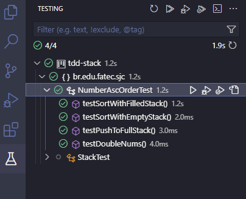

# CLASSE CustomStack
~~~~java
package br.edu.fatec.sjc;

import java.util.ArrayList;
import java.util.List;
import java.util.Stack;

public class CustomStack<T extends  Number> {
    private final Integer limit;
    private int index = 0;
    private List<T> elements;
    private CalculableStrategy<T> calculableStrategy;
    Integer a;
    public CustomStack(int pLimit, CalculableStrategy<T> pCalculableStratey) {
            this.limit = pLimit;
            this.elements = new ArrayList<>();
            this.calculableStrategy = pCalculableStratey;
    }

    public void push(T element) throws StackFullException {
        if(this.size() == this.limit) {
            throw new StackFullException();
        }
        this.elements.add(calculableStrategy.calculateValue(element));
        ++index;
    }

    public T pop() throws StackEmptyException {
        if(this.isEmpty()) {
            throw new StackEmptyException();
        }
        return this.elements.remove(--index);
    }

    public List<T> toList() {
        return new ArrayList<>(this.elements);
    }

    public boolean isEmpty() {
        return this.elements.isEmpty();
    }

    public T top() {
        return this.elements.get((index-1));
    }

    public int size() {
        return this.elements.size();
    }
}
~~~~

# CLASSE Test

~~~~java
package br.edu.fatec.sjc;

import org.junit.Before;
import org.junit.Test;

import static org.junit.Assert.assertEquals;
import static org.junit.Assert.assertThrows;
import static org.junit.jupiter.api.Assertions.assertIterableEquals;
import static org.junit.jupiter.api.Assertions.assertTrue;
import static org.mockito.Mockito.*;
import java.util.Arrays;
import java.util.List;

public class NumberAscOrderTest {

    private CustomStack<Integer> mockStack;
    private NumberAscOrder numberAscOrder;

    @Before
    public void setUp() {
        mockStack = mock(CustomStack.class);
        numberAscOrder = new NumberAscOrder(mockStack);
    }

    @Test
    public void testSortWithFilledStack() {
        when(mockStack.toList()).thenReturn(Arrays.asList(5, 3, 4, 1, 2, 6));
        List<Integer> sortedList = (List<Integer>) numberAscOrder.sort();
        for (int i = 1; i < sortedList.size(); i++) {
            assertTrue(sortedList.get(i-1) <= sortedList.get(i));
        }
    }

    @Test
    public void testSortWithEmptyStack() {
        when(mockStack.toList()).thenReturn(Arrays.asList());
        List<Integer> sortedList = (List<Integer>) numberAscOrder.sort();
        assertTrue(sortedList.isEmpty());
    }

    @Test
    public void testPushToFullStack() throws StackFullException {
        CalculableStrategy<Integer> strategy = element -> element;
        CustomStack<Integer> stack = new CustomStack<>(1, strategy);

        stack = new CustomStack<>(1, strategy);
        stack.push(1);
        CustomStack<Integer> finalStack = stack;
        assertThrows(StackFullException.class, () -> finalStack.push(2));
    }

    @Test
    public void testDoubleNums() {

        when(mockStack.toList()).thenReturn(Arrays.asList(5, 3, 4, 1, 2, 6));
        List<Integer> sortedList = (List<Integer>) numberAscOrder.sort();
        List<Integer> expectedList = Arrays.asList(1, 2, 3, 4, 5, 6);
        assertIterableEquals(expectedList, sortedList);
    }

}

~~~~

